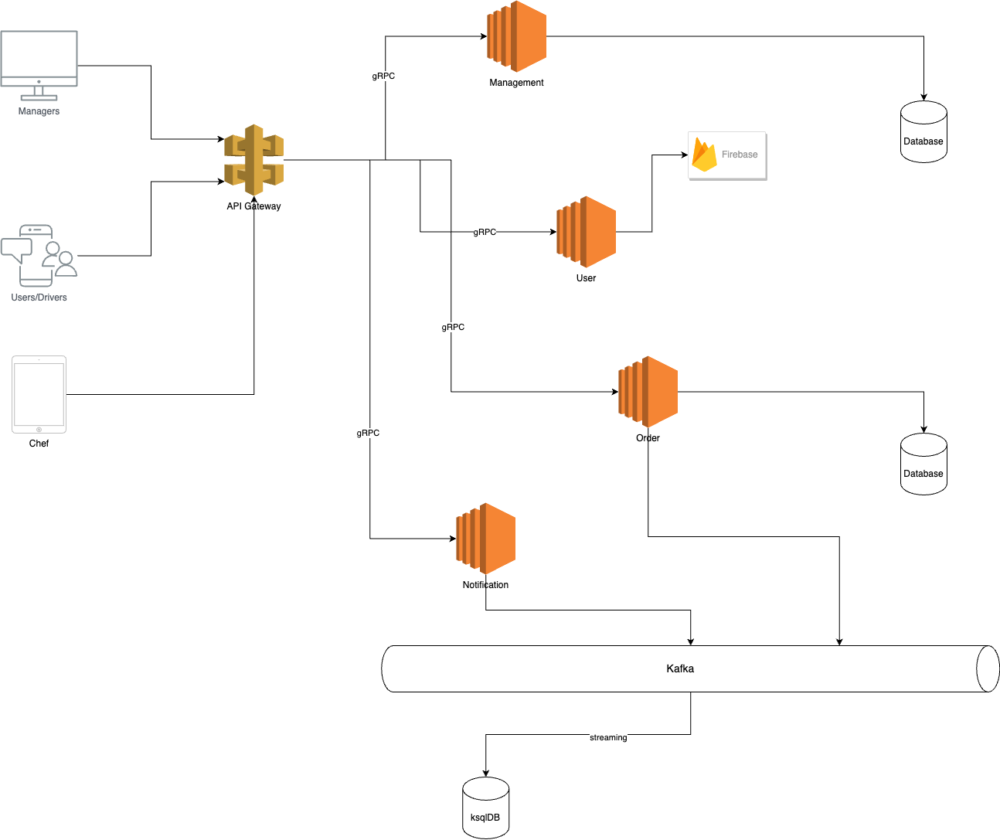
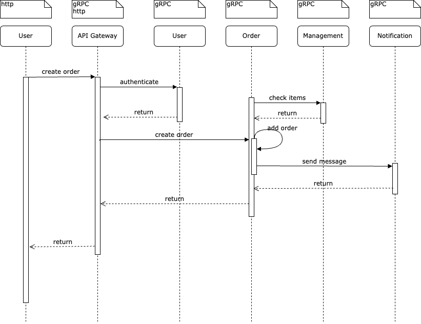
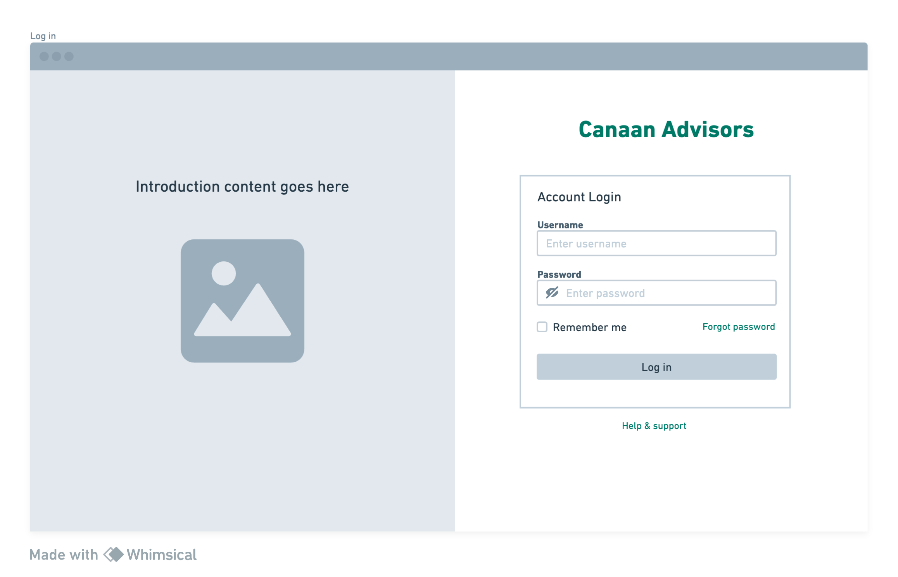
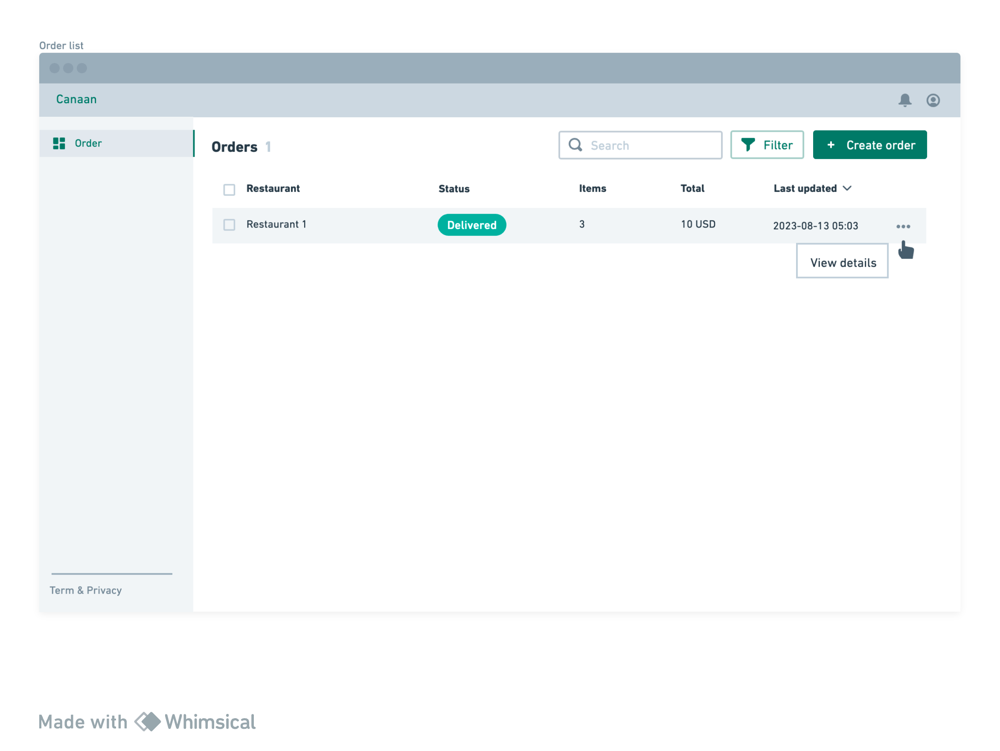
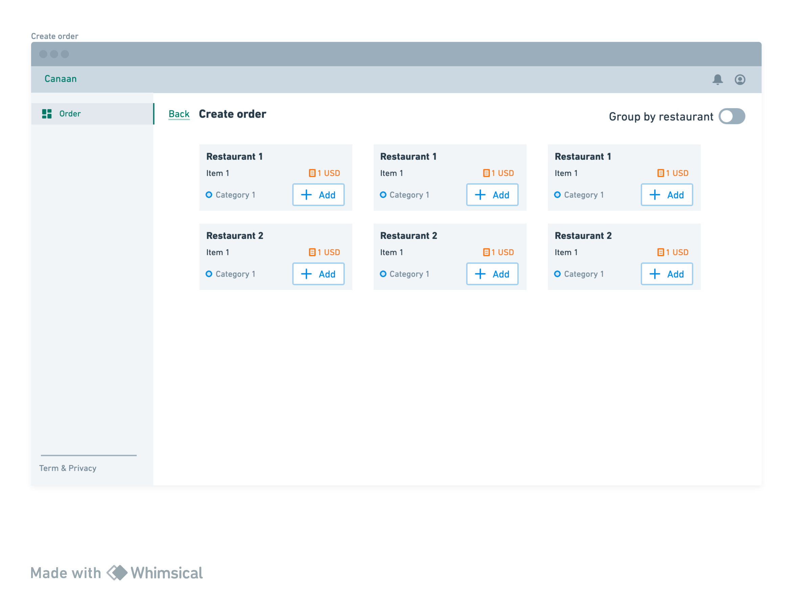
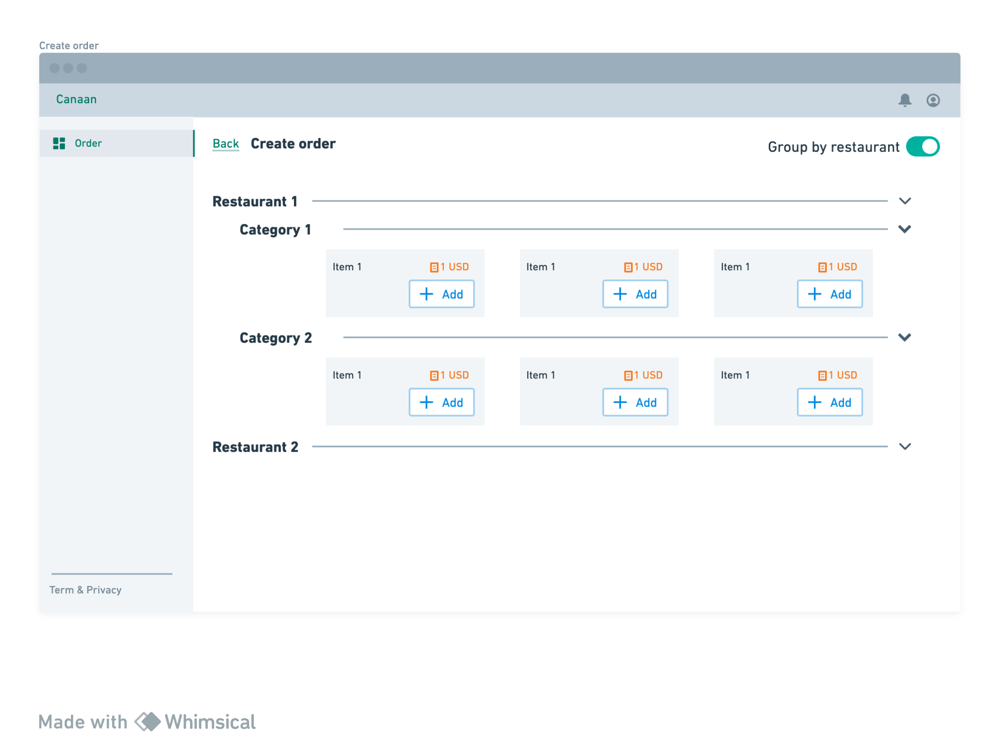
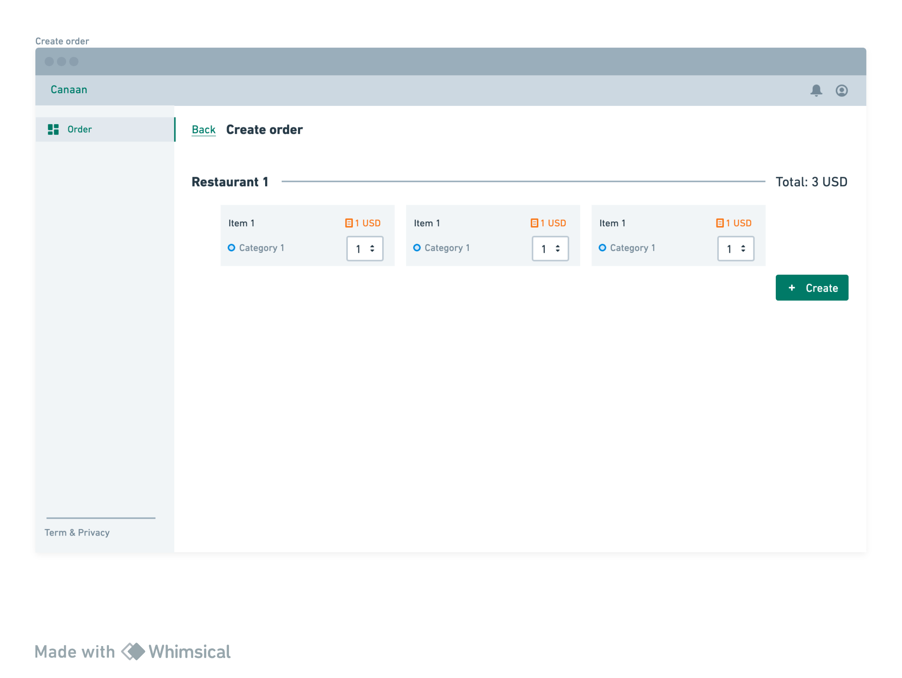

# Canaan Advisors Test

## Task description
- Your task is to develop both the backend API and the web-based interface that will enable users to place orders. 
The API should be implemented using Golang, while the web-based interface should be developed using Next.js.
You are free to choose a database of your preference. It is important to prioritize the backend implementation, 
as it will be evaluated more extensively.
- The user interface should allow users to browse available restaurants, view menus in a tree structure, 
add items to their cart, and place orders. The wireframe below provides three simple pages as a guide. 
After an order is placed, it should be sent to the backend API for processing. 
The API should then store the order in a database and send a notification to both the restaurant owner and the delivery driver.
- The application should include the following features:
  - User authentication and authorization 
  - Management of restaurants and menus 
  - Order management 
  - Notification system
- Please note that while you are not required to fully implement the authentication flow, 
you will need to create three distinct roles: user, driver, and restaurant owner. 
Restaurant owners should be able to add, delete, or update items in the menu, 
while both the restaurant owners and drivers should receive notifications in real-time when orders are placed.

## Prerequisites
1. Create google folders by using `mkdir ./libs/google` and `mkdir ./libs/google/api`
2. Download `annotations.proto` and `http.proto` files from `googleapis github repo`: https://github.com/googleapis/googleapis/blob/master/google/api
3. Add those files to `./libs/google/api`
4. golang 1.19

## How to run local
- Run services and workers: `docker compose up -d`

## TODO tasks
- Integrate APIs and FE
- Implement and integrate order, management database (Postgres)
- Implement authentication flow (Firebase)
- Implement Kafka and ksql for notification
- Implement Redis to cache client id
- Implement API gateway: forwarder and authenticator
- Implement role based permission
- Wireframe for mobile
- Implement notification

## Technologies and Frameworks
- Languages: Go, typescript
- FE Framework: NextJS
- SDK: temporal.io
- Clean architecture
- Network: gRPC, HTTP
- Docker, docker compose
- Database: postgres, redis
- Cloud server: AWS, Firebase

## Architecture
### System Design

### Wireframe

### Services
  - API gateway:
    - Structure: DDD and Clean architecture
    - Features:
      - Forwarder
      - Aggregator
      - Authenticator
    - Database: redis
    - API design: RPC and REST, google.api wrapper
    - Language: go 1.19
  
  - Order service:
    - Structure: DDD and Clean architecture
    - Features:
      - Create orders
      - Manage order lists
    - Database: postgres
    - API design: RPC and REST, google.api wrapper
    - Language: go 1.19
    - Message broker: kafka
    
  - Notification service:
    - Structure: DDD and Clean architecture
    - Features:
      - Receive message
      - Send message
      - Websocket
    - Message broker: kafka
    - API design: RPC and REST, google.api wrapper
    - Language: go 1.19

  - User service:
    - Structure: DDD and Clean architecture
    - Features:
      - Authentication
      - Manage users and roles
    - Database: Firestore
    - API design: RPC and REST, google.api wrapper
    - Language: go 1.19

  - Management service:
    - Structure: DDD and Clean architecture
    - Features:
      - Manage restaurants
      - Manage menu, categories, items
    - Database: postgres
    - API design: RPC and REST, google.api wrapper
    - Language: go 1.19

  - Message broker:
    - Kafka: pub-sub service
    - ksqlDB: stream kafka event for monitoring and debugging

## Directory structure
    📁 canaanadvisors-test
    |__ 📁 api // adapter layer
    |__ 📁 config
        |__ .env
        |__ app.go
    |__ 📁 core 
        |__ 📁 activities // temporal activities
        |__ 📁 app // application layer
        |__ 📁 models // entitiy layer
        |__ 📁 workflows // temporal workflows
    |__ 📁 infra
        |__ logger.go
        |__ temporal.go
    |__ 📁 libs
    |__ 📁 proto
    |__ 📁 worker // temporal workers
    |__ 📁 web // FE
    |__ docker-compose.yml
    |__ go.mod
    |__ go.sum
    |__ README.md

## References
- https://blog.cleancoder.com/uncle-bob/2012/08/13/the-clean-architecture.html
- Transcoding of HTTP/JSON to gRPC: https://adevait.com/go/transcoding-of-http-json-to-grpc-using-go
- https://docs.temporal.io/